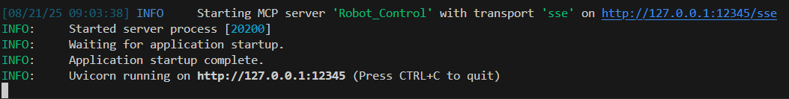
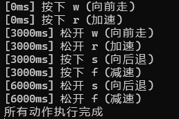

## 实现LLM控制lekiwi机器人的MCP
### 环境要求
- **Python 3.10+**
- **安装依赖：**
    ```bash
    pip install -r requirements.txt
------------
### 部署本地mcp服务
- **进入 `server.py` 的目录下运行**
    ```bash
    python server.py
    ```
    **成功运行示例：** 
      
    
- 服务器默认端口为 `12345` 。如果端口被占用，修改 `server.py` 中以下代码的 `port` 参数：
    ```python
    mcp = FastMCP(name="Robot_Control", host="127.0.0.1", port=12345)
    ```
------
### 部署dify
- **需要安装以下插件：**
    - `MCP Agent 策略` 
    - `MCP SSE / StreamableHTTP`   
    该插件服务配置为(以12345端口为例)：
        ```json
        {  "server_name": {   
            "url": "http://host.docker.internal:12345/sse",
            "headers": {}, 
            "timeout": 50,    
            "sse_read_timeout": 50  
            }
        }
        ```
- 完成配置后在聊天框里输入自然语言指令即可。
------------
### ✅ 成功运行示例

**输入的自然语言指令：**  

> 向前走 3s，同时加速；向后退 3s，同时减速  

**服务器输出结果：**



如果看到如上输出，即表示 **动作已成功执行**！
